**Mühendislik ve Mimarlık Fakültesi**

**Bilgisayar Mühendisliği**

**Siber Güvenlik Ve Büyük Veri**

**Türkiye ve Yurtdışı E-Ticaret Karşılaştırmalı Veri Analizi**

**Belit Berdel Kış**

**17030220009**

2020

**Türkiye ve Yurtdışı E-Ticaret Karşılaştırmalı Veri Analizi**

Belit Berdel Kış

*Mühendislik ve Mimarlık fakültesi Bilgisayar Mühendisliği*

*Beykent Üniversitesi*

*belitberdelk\@hotmail.com*

**Özet**

***Bu doküman 21 aralık Siber Güvenlik ve Büyük Veri dersi projesi için
hazırlanmış yazılı raporu içermektedir. Raporda Türkiye'nin artan
E-ticaret piyasa hacmi üstüne yapılan analiz hakkında bilgilendirme yer
almaktadır. Türkiye ve yurtdışında bulunan bir ülkenin E-ticaret piyasa
hacmine göre karşılaştırma yapılmak istenmiştir. Bulunan veriler
sonucunda Türkiye BKM Moto ve E-ticaret satış bilgileri ile Amerika
Birlişik Devletleri E-ticaret verileri karşılaştırılmıştır. Türkiye veri
setinden seçilen verileri temel alarak ileri tarihe göre E-ticaret
piyasa hacmini tahmin edebilen bir model oluşturulmak istenmiştir.
Araştırma sonucu olarak Türkiye'nin ticari açıdan ileri tarihlerde
artacağı belirlenmiştir.***

GİRİŞ
=====

Dünya Ticaret Örgütü'ne (WTO) göre e-ticaret: "Mal ve hizmetlerin
üretim, reklam, satış ve dağıtımının telekomünikasyon ağları üzerinden
yapılması" şeklinde tanımlanır. Bir internet sitesi üzerinden ürün ve
hizmet gibi ticari varlıkların çeşitli ödeme sistemleri ile alış-veriş
işleminin yapılabilmesini sağlar.

E-ticaretin tarihi ise genel olarak internetin henüz çok eski bir
teknoloji olmamasından dolayı yakın geçmişe dayanmaktadır. 1970'lerde
Stanford'lu öğrenciler, Massachusetts Teknoloji Enstitüsü'nde okuyan
öğrencilere ARPANET hesapları ile yapay zekâ laboratuvarını kullanarak
uyuşturucu madde satmaları ile başladı. 1994 yılında Pizza Hut, ilk
e-ticareti kullanan şirket oldu.

Türkiye'de e-ticaretin piyasa değerinin artmasıyla popülerleşen online
alış-veriş sektörü E-ticaret bilgi platformunun açıklamasına göre şekil
1'de görüldüğü gibi 2020'nin ilk 6 ayı 2019 yılının ilk 6 ayına göre %64
artış göstermiştir.

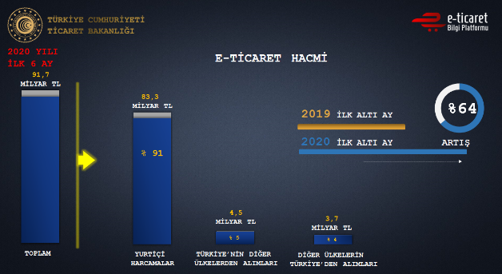

Şekil 1: Türkiye E-Ticaret Hacmi (e-ticaret bilgi Platformu 2020
raporundan uyarlanmıştır).

Kovid-19 nedeniyle yapılan karantinalar sonucunda artan e-ticaret
satışları fiziksel ortamda satış yapan kişiler ve işletmelerinde online
sistemlere yönlenmesini sağlayarak piyasa hacmi büyümüştür. Diğer
ülkelerde aynı durumda e-ticarette büyüme yaşayarak dünya geneli artışa
sebep olduğundan mikro seviyeden makro seviyeye kadar servis sağlayan
e-ticaret siteleri yaygınlaşmaya başlamıştır. Türkiye'de bulunan popüler
e-ticaret siteleri popülerlik sırasına göre;

1.  Hepsiburada

2.  Gittigidiyor

3.  N11

4.  Sahibinden

5.  Yemeksepeti

sıralanabilir.

Bu makalede son zamanlarda yükselişe geçen e-ticaretin Türkiye'deki
artışı ve yurtdışı ekonomileri ile karşılaştırılması ele alınmıştır.
Genel bakış üstünden istatistiksel analiz yapılmış olup ileriye yönelik
tahmin yapılabilmesi için zaman serisi ile regresyon analizi
yapılmıştır.

Araştırmada analizler Moto ve E-ticaret işlemleri üstünden yapılmıştır.
Moto işlemleri telefon ve/veya mail üzerinden kartsız yapılan işlemler
olarak tanımlanır. Online ödemelerde kartlı işlemler ve Moto
işlemlerinin genel toplamı sonucu piyasa hacmi bulunurak geliştirilen
modelle var olan durum analizleri ve ileriye yönelik tahminler yapılması
planlanmıştır.

KULLANILAN VERİ SETİ VE YÖNTEMLER
=================================

**2.1. Veri seti**

Bu projede kullanılan Türkiye e-ticaret satış veri seti olarak BKM'nin
Moto and E-Commerce Transactions verileri kullanılmıştır \[5\]. Yurtdışı
veri seti olarak EU için Eurostat'da bulunan veri seti gerekli olan
piyasa hacmi veya tarih gereksinimleri karşılamadığından
kullanılmamıştır. Yurtdışı alternatifi olarak Amerika Birleşik
Devletleri (A.B.D.) ST. LOUIS Federal Bankasının E-Commerce Retail Sales
veri seti kullanılmıştır.

Proje için veri seti içinde senelik çeyrekler halinde e-ticaret hacmi
ile ilgili veriler gerekmektedir. Tarih ve hacim verisi başka verilerden
türetilmediği için set büyüklüğü kısıtlıdır.

-   Türkiye veri setinde 63 örnek bulunmaktadır.

-   A.B.D'nin veri setinde 84 örnek bulunmaktadır.

-   Veriler 3'er aylık seriler şeklinde bir seneyi çeyreklere ayıracak
    şekilde düzenlenmiştir.

-   Veri setleri gözlem tarihi ve tarihe bağlı toplam e-ticaret
    satışlarını barındırmaktadır

### Veri Seti Analiz Yöntemi

Verilerin projenin amacına uygun analiz edilebilmesi için iki veri
analiz türü kullanılmıştır. Proje amacı olarak iki varlık arasında
bulunan farkların belirlenmesi için istatistiksel fark analizi
yapılmıştır.

2.1.1.1. Fark analizi iki grup arasında varyans analizi gibi çalışmalar
ile istatiksel farklılık analizi yapılmasıdır.

2\. 1.1.2 Tahmin Analizi

Belirli değişkenler doğrultusunda ileri zamanlı tahmin yapılabilmesi
için yapılan analizdir. Bir bağımlı ve bağımsız değişken arasında
bulunan ilişki ile ileriye yönelik regresyon analizi yapılır.

2.2. Görselleştirme Yöntemleri 
------------------------------

Analiz sonrası elde edilen verilerin sunulabilmesi için anlamlı bir hale
getirilip veriyi en iyi şekilde göstermeyi amaçlayan grafik ve/veya
yazılı anlatılarak gerekli açıklamalar yapılması önemlidir.

Fark analizi doğrultusunda genel olarak iki nesne arasında karşılaştırma
ve ileriye yönelik tahmin için pasta ve çizgi grafiği kullanılmıştır.

2.3. İleriye Yönelik Tahmin Analizi 
-----------------------------------

İleriye yönelik tahmin zamana bağlı artış ve azalış üzerinden önceki
tarihlerde piyasa hacmi bilgisi üzerinden regresyon analizi yaparak
zaman serisi tahmini yapmaktadır. Finansal alanda genel olarak birden
fazla değişkene bağlı olarak ileriye yönelik karar alınması ve/veya
bağlı etkenlerin bulunması gibi konularda kullanılır.

Piyasa hacmi içinde Türkiye içinde yapılan işlemler bulunmaktadır.
İşlemler çizelge 1 de belirtildiği gibi ayrılmaktadır. Satış tutarları
toplamı genel piyasa hacim büyüklüğünü belirler.

  |Satış işlemleri  | Satış tutarları     |
  |-----------------| --------------------|
  |Yerel kart       | Yerel satış         |
  |Yabancı kart     | Uluslararası satış  |

Çizelge 1: İşlem Tipleri

LİTERATÜR ARAŞTIRMASI
=====================

**3.1. Türkiye'de E-Ticaretin Gelişimi**

Türkiye'de ilk internet kullanımı 12 Nisan 1993 tarihinde
gerçekleşmiştir. O dönem ABD\'nin Türkiye\'ye kiraladığı internet sadece
tek bir hat üzerinden çalışıyordu. Bu internetin ilk olarak Orta Doğu
Teknik Üniversitesi'nde kullanıldığı ve daha sonra 1994 yılında Ege
Üniversitesi'nden 64 KB/s hızla bağlantı sağlandığı bilinmektedir.
Yaşanan gelişmelerle beraber akademik alanda üniversiteler arası
iletişim sağlanması için Ulusal Akademik Ağ (ULAKNET) çalıştırılmaya
başlanmıştır. ULAKNET sayesinde üniversiteler arası yaşanan iletişim
problemlerinin engellenmesi hedeflenmiştir. Daha sonraki süreçte
internetin diğer üniversiteler tarafından da kullanılmaya başlanması ve
teknolojik altyapının da gelişmesiyle beraber internetin Türkiye\'de
kullanılması daha yaygın bir hal almıştır. Tüm bu gelişmelerden sonra
Türkiye\'de yapılan ilk e-ticaret faaliyetinin Remzi Kitabevi\'nin 1997
yılında yayınladığı e-dükkânı olduğu bilinmektedir. Bu yıllarda bilgi ve
iletişim teknolojilerinin yeterince gelişmemiş olması ve yazılım
maliyetlerinin dönem için çok yüksek olması nedeniylee-ticaret
sistemleri genellikle bankalar ve diğer büyük ölçekli firmalar
tarafından kullanılabilmiştir \[1\].

**3.2. Türkiye'de E-Ticaret Sektörünün Yıllara Göre Gelişimi**

TÜİK'in araştırma sonuçlarına göre; 2016 yılında %93,7 olan 10 ve daha
fazla çalışana sahip girişimlerin "internete erişim oranı" 2017 yılında
%95,9 olarak tespit edilmiştir. Çalışan sayısının büyüklük oranlarına
göre internet erişim oranları ise; 10-49 çalışana sahip girişimlerde
%95,4, 50-249 çalışana sahip girişimlerde %97,8, 250 ve üzeri çalışana
sahip girişimlerde ise %99,7 olmuştur. 10 ve daha fazla çalışana sahip
girişimler için "bilgi-sayar kullanım oranı" 2016 yılında %95,9 iken
2017 yılında bu oran %97,2 ye yükselmiştir. Girişimler bir önceki yıl
%66 oranında web sayfasına sahip iken, 2017 yılında bu oran %72,9\'u
bulmuştur. "Web sayfasına sahip-lik" oranında %87 ile ilk sıralarda 250
ve üzeri çalışana sahip olan girişimler yer alırken, bunları %82,1 ile
50-249 çalışana sahip girişimler ve

Türkiye'de E-Ticaret sektörünün yıllara göre gelişimi Uluslararası
Toplum Araştırmaları Dergisi tarafından %70,5 ile 10-49 çalışana sahip
girişimleri takip etmiştir. 2017 yılında girişimlerin %94,2\'si
internete erişimde geniş bant bağlantısı kullandıkları belirlenmiştir
\[2\].

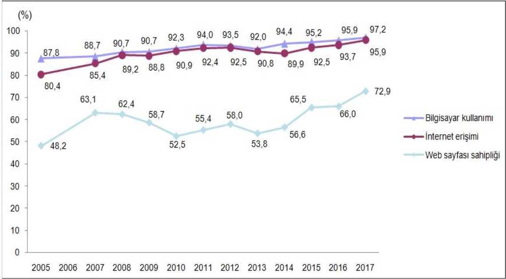

Kaynak: TÜİK, Girişimlerde Bilişim Teknolojileri Kullanım Araştırması,
2017

**3.3.Türkiye'de E-Ticaret İşlem Hacmini Etkileyen Faktörler Üzerine Bir
Araştırma: Bir Model Önerisi**

Yapılan araştırmalarda ülkemizde e-ticareti düzenleyen mevzuatın
yetersizliğinin ön plana çıktığı görülmüştür. E-ticareti düzenleyen
yasaların sınırlıkları sanal ortamda ticaretin hala belirsizlik olarak
algılandığı ve bu nedenle işletmelerde İnternete erişim oranlarının çok
yüksek olmasına karşın, e-ticareti kullanma oranlarının düşük olduğunu
ortaya koymuşlardır \[3\].

E-ticaretle ilgili yasal düzenlemelerin yeniden yapılandırılması
üretici, tüketici ve ithalat ihracat boyutunda kişi ve kurumları güvende
hissettireceği için e-ticarette artışın olması mümkün olabilecektir.
Özdemir, Törenli ve Kıyan (2010) araştırmalarında Ulusal alanyazında
e-ticaret İşlem Hacmini etkileyen ekonomik ve hukuki faktörleri konu
alan bir araştırmaya rastlanmadıklarını ifade etmişlerdir \[3\].

**3.4. Türkiye'de ve Dünyada Sınır Ötesi Elektronik Ticaret**

Dünya ticaretindeki eğilimlerin etkisiyle özellikle 2010'lu yıllarda
şirketler ürünlerini yurt dışı piyasalara online kanallar aracılığıyla
ulaştırmaya başlamışlardır. Bu şekilde üretici ve satıcılara global
olarak iç pazar dışına kolayca çıkabilmesi ve vergi vb. ödemelerden uzak
kalması nedeniyle cazip gelmiştir. Tüketicilerde ise geniş bir ürün
yelpazesine sahip olunması ve aynı zamanda aynı fiyata çok daha
kalitelisini bulması e-ticareti bir cazibe merkezi haline getirmiştir.
E-ticaret platformlarının gelişimi, internet ve mobil penetrasyon
artışı, ödeme yöntemleri ve lojistik faaliyetlerinde ilerleme
kaydedilmesi, bilinçli tüketici sayısındaki artış gibi faktörler ile
dünyada sınır ötesi ticaret hızla büyümektedir. , E-ticaretin
gelişiminde Pazar bulma kolaylığı, global bir pazarın sunulması,
teknoloji ile kolay ulaşılabilir olması gibi birçok faktör
sayılabilirken bir ülkede e-ticaret yasalarının durumu e-ticaret
potansiyelini belirlemekte ön plana çıkabilmektedir \[6\].

3.5. Dünya'da E-Ticaret Nereye Gidiyor? 
---------------------------------------

Forrester'ın raporuna göre ABD'de mobil cihazlar üzerinden
gerçekleştirilen ticaretin 2020'ye kadar 252 milyar dolara ulaşması,
mobil ödemelerin de 2019 yılına kadar 141 milyar doları aşacağı
öngörülmüştür. Tüketicileri ve şirketleri sahteciliğe karşı önlem almak,
güvenlik ve risk profesyonellerinin mobil alandaki sahtecilik ataklarına
karşı Experian adlı bilgi hizmetleri şirketini kullandıkları
görülmüştür. Experian, sahtecilik durumlarının yaşanmasının önüne
geçiyor. Experian, dijital kanaldan gelen kredi başvurularında
sahtekarlığın önlenmesi, müşterilerin oturum güvenliğinin sağlanması
için gerekli başarılar sağladığı görülmektedir \[7\].

A.B.D.'de mobil ticaretin 2020 yılında 252 milyar doları aşacağı tahmin
edilirken bunun temelinde Forrester'ın hazırladığı 'Mobil Sahtecilik
Yönetimi Çözümleri Raporu'na göre, sanal/online dolandırıcılığın
azalması olduğu belirtilmiştir. Raporda aynı şekilde ABD'de akıllı
telefon ve tabletler üzerinden yapılan mobil ticaretin, 2020 yılına
kadar yaklaşık 252 milyar doları, mobil ödemelerin ise 2019 yılına kadar
yaklaşık 141 milyar doları aşacağı tahmin edildiği belirtilmiştir \[7\].

Bu nedenle bu araştırmanın temelini yukarıda bahsedildiği gibi
tahminlere ulaşılıp ulaşılmadığının araştırılması ve aynı zamanda
ileriki yıllarda e-ticaret verilerinin, geliştirilecek bir modelle,
tahmin edilebilirliğini sınama amacı oluşturmuştur. Geliştirilecek bu
modelin doğrultusunda gelecek yıllara yönelik tahminlerin e-ticaret
girişimcilerine farklı değişkenler üzerinden bilgi sağlayabileceği
düşünülmektedir.

KULLANILAN TEKNOLOJİLER
=======================

1.  **Veri Analizi**

Araştırma için yapılacak analizlerde veri seti üzerinde analiz ve manipülasyon yapılabilmesi için açık kaynaklı PANDAS kütüphanesi kullanılmıştır. Zaman ve değer verilerinin makina öğrenmesi süreci için gereken veri formatına dönüştürülmesini sağladığı için bu projede PANDAS kullanımı tercih edilmiştir.

2.  **Tahmin Modeli**

Projenin temel amacı olan ileri tarihli piyasa hacim tahmini için
PANDAS'tan elde edilen sonuçlar üzerinden PROPHET kütüphanesi yardmıyla
finansal veriler üstüne regresyon analizi yapabilme kabiliyeti ile ileri
tarihli tahmin yapılabilmesini sağlamaktadır. PROPHET kütüphanesi
Facebook tarafından toplamsal model ile zaman tabanlı trend takibi için
geliştirilmiş tahmin modülüdür. Açık kaynaklı olarak geliştirildiğinden
öğrenme kaynakları bulunmaktadır. Kullanımı için AutoTS otomatik makina
öğrenmesi ve gluonts zaman serisi modelleme kütüphanelerinin sağladığı
altyapı ile zaman verisi üstünde regresyon yapabilmeyi sağlar.

3.  **Görselleştirme**

Finansal analizin anlaşılabilir bir formatta görselleştirilmesi için
MATPLOTLIB ve PLOTLY kullanılmıştır. MATPLOTLIB statik, dinamik ve
interaktif görselleştirme kütüphanesidir. Elde edilen verilerin ve
sistem çıktılarının gösterilmesi için uygun bulunmuştur. PLOTLY bilimsel
görselleştirme kabiliyeti bulunan bir platformdur. Verilerin ve tahmin
modeli sonuçlarının anlamlandırılması için görselleştirme önemli bir yer
tutmaktadır. Araştırmanın raporlaştırma ve anlaşılırlığını desteklemek
içinse PLOTLY kullanılmıştır.

PROJE SÜRECİ
============

**5.1. Araştırma Süreci** 

Projenin amacı doğrultusunda Türkiye ve Yurtdışında bir ülkenin E-ticaret piyasaları hakkında bilgi toplanması için internet üzerinde ülkelerin resmi kaynaklardan yayınladığı veriler araştırılmıştır. Araştırmam sonucunda Avrupa'nın resmi verileri özel girişim şirketlerin açıklamasından ve veri seti içindeki tutarsızlıklardan kaynaklı bu verilerin kullanılmamasına karar verilmiştir. Diğer ülkelerin aynı veya daha fazla detay içeren e-ticaret veri setleri arasında A.B.D.'nin ve Türkiye'de bulunan bankalar arası Kar Merkezinin Moto ve E-ticaret 2020'nin 3.cü çeyreğine kadar olan veri seti seçilmiştir. Veri setleri üzerinde işlem yapılabilmesi için, daha önce de belirtildiği gibi, açık kaynaklı olan PANDAS veri analizi ve manipülasyon kütüphanesi kullanılmasına karar verilmiştir. 

Araştırma finans alanında yapılacağı için finansal veriler arası
karşılaştırma ve sonuçların görselleştirilmesi hakkında araştırma sonucu
endeks, pasta ve çizgi grafiği eklenmesi gerektiği düşünülmüştür. Grafik
üretimi için görselleştirme kütüphaneleri arasında seçilen MATPLOTLIB ve
PLOTLY kullanılmıştır.

İleri tarihli tahmin uygulaması için zaman bilgisi üstünden işlem
yapabilen bir sistem üstüne araştırma yapılmıştır. Var olan zamansal
analiz sistemlerinin geliştirildiği kütüphaneler ve programlar arasında
SKLEARN altyapısını ve AutoTS ile otomatik makina öğrenmesi kullanan
PROPHET isimli tarihsel veriler üzerinden linear trend tahmini yapabilen
bir kütüphane bulunmuştur. PROPHET'in gereksinimlerini veri seti içinde
bulunan gözlem tarihi ve sayıyla karşıladığı, yapılan denemeler sonucu
uygun program olduğu, belirlenmiştir.

**5.2. Uygulama Süreci**

Bulunan veri setleri öncelikle projenin amacına göre zaman ve hacim
olmak üzere iki sütun olacak şekilde veriler düzenlenmiştir. Düzenlenen
verilerle ilk olarak zamana bağlı karşılaştırma yapılmıştır.

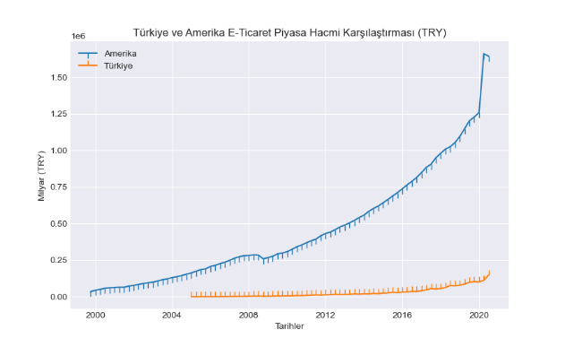

Şekil 2: A.B.D. ve Türkiye E-Ticaret grafiği

E-ticaret verilerinin başlangıç tarihleri A.B.D.'de 1999 ve Türkiye'de
ise 2001 olarak belirlenmiştir. Verilere bakıldığında e-ticaretin piyasa
hacminin sabit olarak arttığı görülmektedir. Görselleştirme olarak
MATPLOTLIB ile iki ülkenin çizgi grafiği farklı renklerde çizilmiştir ve
verilerin bulunduğu noktalar çizgiler ile belirtilmiştir. A.B.D. veri
seti dolar bazından yapılmış olması nedeniyle Türkiye ile kıyaslanması
için güncel kur üzerinden dolar verileri TL'ye dönüştürülerek
görselleştirilmiştir.

Projenin dolar üstünden yapılan grafiği şekil-3'te olduğu gibi
görülmektedir. Grafikte de görüldüğü üzere dolar ve TL değerlerinin
farklı olmasından kaynaklı Türkiye anormal bir şekilde A.B.D.'den daha
hızlı bir şekilde büyümesi söz konusu olmuştur. Bu durum fark edildikten
sonra paraların kur dönüşümleri yapılarak analizler TL üzerinden
yapılmıştır.

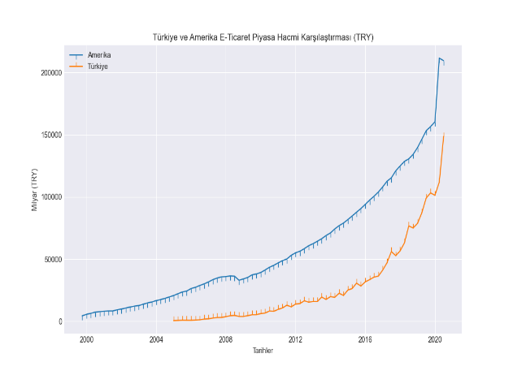

Şekil 3: Hatalı A.B.D. ve Türkiye E-Ticaret grafiği

Düzeltilen veri seti ile Türkiye'nin 2018 ve 2019 arasında Şekil 4'te ve
Şekil 5'te bulunan piyasa hacmi karşılaştırma sonucunda artış
görülmüştür.

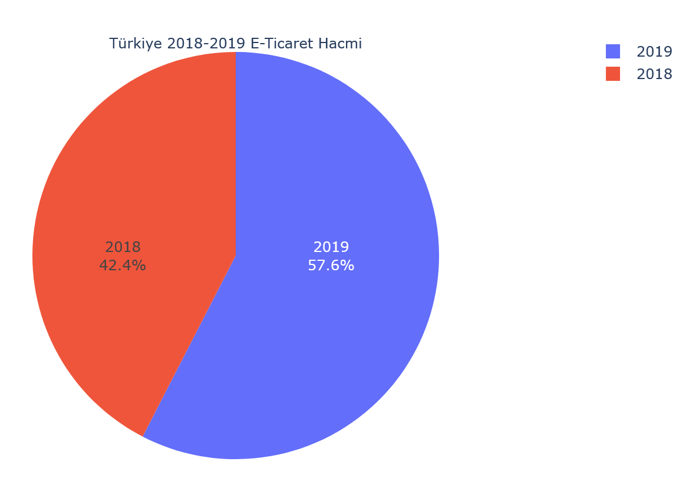

Şekil 4: Türkiye 2018 ve 2019 piyasa hacmi karşılaştırması

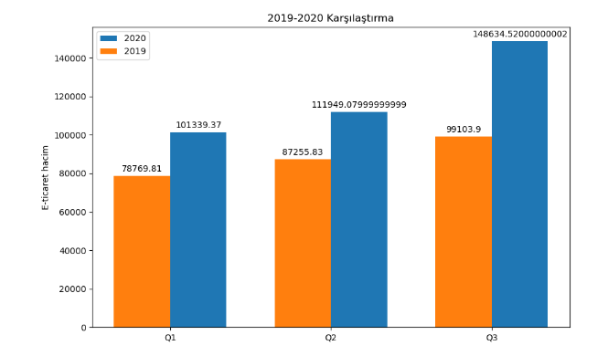

Şekil 5: Türkiye 2019-2020 Karşılaştırma tablosu

**5.3. Tahmin Uygulaması Süreci**

*5.3.1. Türkiye için Tahmin Uygulaması*

Veri setinin düzenlenmesi sonrasında tahmin programının geliştirilmesine
başlanmıştır. Kullanılmasına karar verilmiş olan PROPHET kütüphanesi
finansal veriler üstünde regresyon analizi yardımı ile ileri tarihli
tahmin yapılabilmesini sağlamıştır. PROPHET'ın çalışması için gerekli
olan veri tarih-zaman formatına dönüştürüldükten sonra modele
yerleştirilmiştir. Tahmin edilmesi istenen tarihler aynı zaman
formatında bir liste olarak alınmıştır. %20 test ve %80 öğrenme verisi
olmak üzere sıralı olarak bölünmüştür. 148 iterasyon sonucunda zaman
listesinin tahmin sonucu olarak alınan tahmin ve tahmin aralıkları şekil
6'te görselleştirilmiştir.

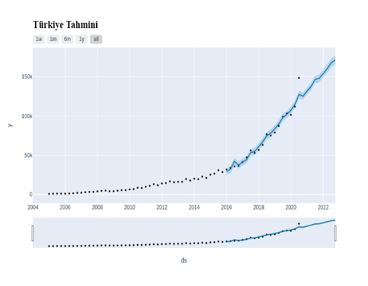

Şekil 6: Türkiye Tahmin sonucunun görseli

Tahmin sonucu olarak yıllık piyasa hacminin aylık trendi belirlenerek
şekil 7'da görüldüğü gibi yaz mevsimi başlangıcı ve sonunda azalma
görülmektedir. 2020 yılı içerisinde öngörülmemiş nedenlerden dolayı
oluşan etkenlerin sonucu hata payı etkilenmiştir.

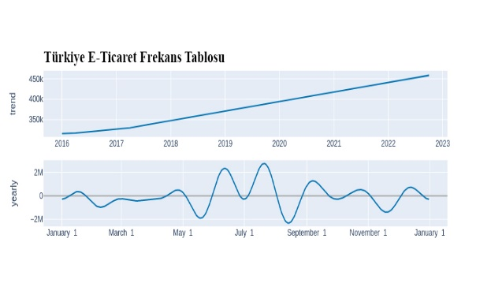

Şekil 7: Türkiye Aylık trend analizi

Model hata oranı şekil 8'de gösterilmiştir ve 0.388 oranında olup bu
hata payı performansı sistem analizi sonrasında azaltılabilmiştir.

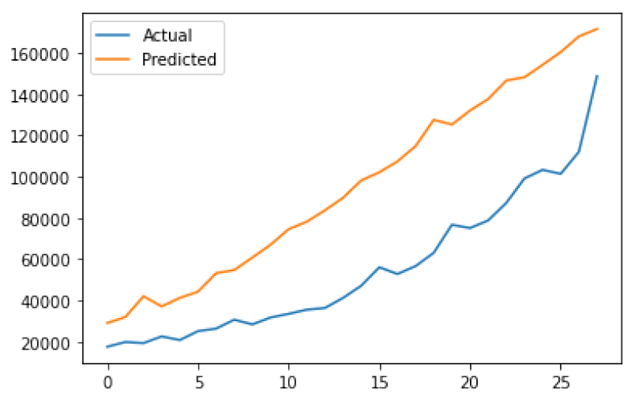

Şekil 8: Türkiye Modeli Hata grafiği

*5.3.2.* A.B.D. *için Tahmin Uygulaması*

Türkiye için yapılan sistem modeli A.B.D. üzerinde denenmiştir. İleri
tarihli tahmin olarak şekil 9'de görüldüğü gibi artış görülmüştür.

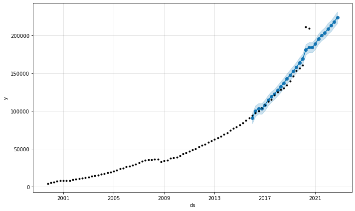

Şekil 9: A.B.D. Tahmin sonucu

Tahmin sonucu olarak yıllık piyasa hacminin aylık trendi şekil 10'da
görüldüğü gibi ilkbahar ve yaz mevsimlerinde dalgalanmalar göstermiştir.
Geri kalan zamanlarda trendlerin monotonlaştığı görülmüştür.

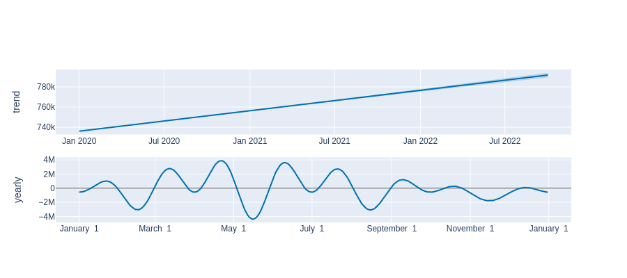

Şekil 10: A.B.D. Aylık Trend Analizi

**SONUÇ**
=========

Araştırma sonucunda E-ticaret hacminin dünya çapında giderek artacağı ve
model içinde değişkenler arttırılarak trendlerin belirlenebileceği
çıkarımı yapılabilir. Yapılan model geliştirilerek araştırma amacına
göre uygulanabilir veya gerçek zamanlı sistemler üzerinden ileri zamanlı
tahminler yapılabilmesini sağlayabilir. Türkiye'de 2020 içinde olan
öngörülmemiş olayların modelin tahmin kabiliyetinin etkilenmiş
olabileceği düşünülmektedir. Araştırma sonucu geliştirilen modelin 2020
yılı ve sonrası veriler ile tekrardan sınanması planlanmaktadır. Sonuç
olarak bu çalışmada:

-   E-Ticaret'in ne olduğu

-   2020 yılına kadar olan E-ticaret piyasa analizi

-   Finansal analiz modeli

-   Model uygulaması

konularından bahsedilmiştir ve yapılan çalışma sonucunda makine
öğrenmesi yardımıyla E-ticaretin ileride gelişebileceği sonucuna
varılmıştır.

KAYNAKLAR
=========

1.  Arş. Gör. Kadir KAYA, Arş. Gör. Dr. Mahmut Can ŞENEL, Prof. Dr.
    Erdem KOÇ,PERAKENDE TİCARET SEKTÖRÜNÜN TÜRKİYE'DEKİ GENEL DURUMU,
    <https://dergipark.org.tr/tr/download/article-file/571035> -

2.  BURAKHAN İLTER,TÜRKİYE\'DE E-TİCARETİ BELİRLEYEN FAKTÖRLER -
    BURAKHAN İLTER, İzmir 2020

3.  Ufuk TÜREN, Yunus GÖKMEN, İsmail TOKMAKTÜRKİYE'DE E-TİCARET İŞLEM
    HACMİNİ ETKİLEYEN FAKTÖRLER ÜZERİNE BİR ARAŞTIRMA: BİR MODEL
    ÖNERİSİ,2011

4.  <https://www.hurriyet.com.tr/ekonomi/kobi/turkiyedeki-en-basarili-10-e-ticaret-sitesi-40271110--->
    liste linki

5.  <https://web.archive.org/web/20110902073637/http://www.bkm.com.tr/donemsel-bilgiler.aspx>
    \-\-\--eski bkm verileri \-\-\-\--
    <https://bkm.com.tr/internetten-yapilan-kartli-odeme-islemleri/>
    \-\-\--yeni bkm verileri

6.  Yılmaz Onur ARİ,TÜRKİYE'DE VE DÜNYADA SINIR ÖTESİ ELEKTRONİK
    TİCARET,2019

7.  Aydın Nevin, DÜNYA'DA E-TİCARET NEREYE GİDİYOR

8.  Proje kaynak dosyası linki - https://github.com/BelitK/bigdataodev
